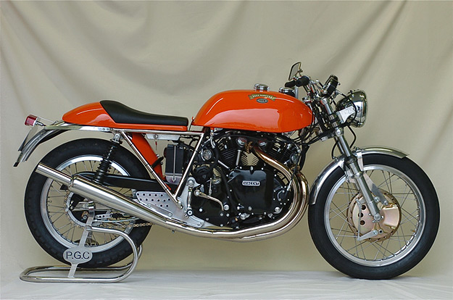
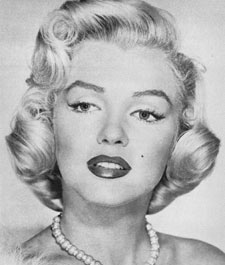

Computer Vision - Image Manipulation
====================================

### Introduction
This project is created for experiencing some tasks about computer vision.

### Description
This project consists of three parts. In the following, details of the parts are described. Implementations are done by using only _"numpy"_.

#### part1
At this part, two images are merged according to an _α_ value. The output image is calculated by _𝐶 = α𝐹 + (1−α)𝐵_ formula where F represents the first image and B represents the second image.

In the following examples, _α_ is taken as "0.5".

First Image                   |  Second Image                 | Result
----------------------------- | ----------------------------- | -----------------------------
 |  | 
 |  | 
 |  | 
 |  | 
 |  | 

#### part2
This part consist of 5 parts. All parts are to manipulate the input image which is named _"A.png"_.

**Part 2.1:** Pixels of the image are printed in non-increasing order:
> [255, 255, 255, 255, 255, 255, 254, 254, 254, 254, ...

**Part 2.2:** Histogram of the image is created. It consists of 20 groups:
> 

**Part 2.3:** New image is created. Pixel of the new image is red if pixel of the _"A.png"_ greater than the threshold. Otherwise, it is black. At below, there are three results with different thresholds:
> Threshold = 50                 |  Threshold = 120               | Threshold = 190  
> ------------------------------ | ------------------------------ | -----------------------------
>  |  | 

**Part 2.4:** New image is created which is left bottom part of the _"A.png"_:
> 

**Part 2.5:** New image B is created with gray level. This image is the difference of the each pixel and average of the A's pixels. For example, A(25,30) = 120 and the average pixel density in A is 98. Then B (25,30) = 120 - 98 = 22. At below, result is shown:
> 

#### part3
There is a 3D model named _"mug.off"_. At this part, vertex coordinates of the model are derived and shown by plotting.
> 

### License
Copyright 2019 Burak Kuyucu

Licensed under the Apache License, Version 2.0 (the "License");
you may not use this file except in compliance with the License.
You may obtain a copy of the License at

http://www.apache.org/licenses/LICENSE-2.0

Unless required by applicable law or agreed to in writing, software
distributed under the License is distributed on an "AS IS" BASIS,
WITHOUT WARRANTIES OR CONDITIONS OF ANY KIND, either express or implied.
See the License for the specific language governing permissions and
limitations under the License.

